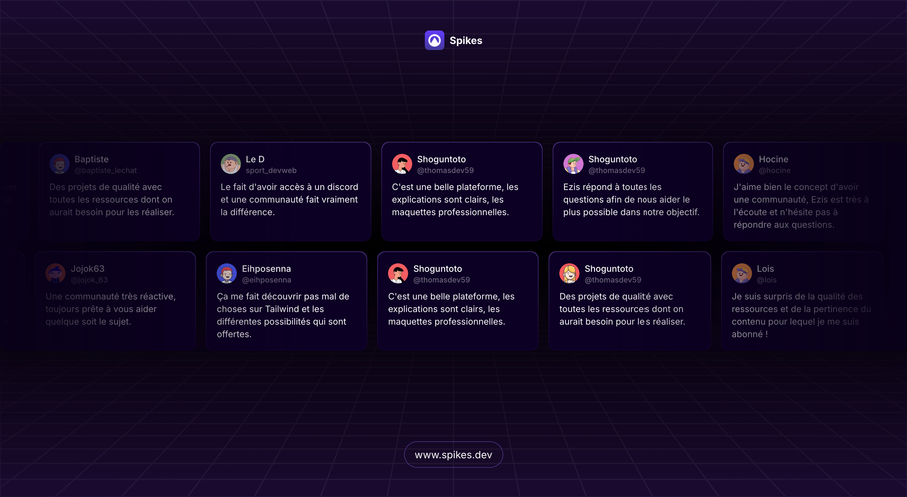

# Reviews Section with NextJS

This is a reviews section built with NextJS and the [Marquee Component](https://magicui.design/docs/components/marquee#props) by Magic UI.



## Installation

Step-by-step instructions on how to get the development environment running.

```bash
# Clone the repository
git clone https://github.com/gmagnenat/yourproject.git

# Navigate to the project directory
cd yourproject

# Install dependencies
pnpm install
```

## Usage

```bash
# Run the application in dev mode
pnpm dev

# Build the application for production
pnpm build

# Run the application
npm start
```

## Contributing

Guidelines for contributing to the project.

1. Fork the repository.
2. Create a new branch (`git checkout -b feature-branch`).
3. Make your changes.
4. Commit your changes (`git commit -m 'Add some feature'`).
5. Push to the branch (`git push origin feature-branch`).
6. Open a pull request.

## Contact

Gwenaël Magnenat - [LinkedIn]("https://linkedin.com/in/gmagnenat")

Live URL: [https://keen-queijadas-ce6df2.netlify.app/](https://keen-queijadas-ce6df2.netlify.app/)
